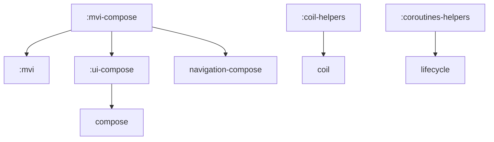

# BRBXDevKit

[](https://jitpack.io/#BRBXGIT/BRBXDevKit)

BRBXDevKit is an Android development toolkit designed to simplify **MVI architecture** implementation, also provide **Compose components**, and offer essential helper utilities.

---

## 🛠️ How it Works (MVI Architecture)

The core of BRBXDevKit is a robust **MVI (Model-View-Intent)** pattern that ensures a predictable, unidirectional data flow and strict separation of concerns.

### Core Concepts
- **State**: The single source of truth representing the UI.
- **Intent**: User actions dispatched to trigger logic.
- **BrbxEffect**: One-off side effects (Navigation, Snackbars, Toasts).
- **Processors**: The "brain" of your feature, where business logic lives outside the ViewModel.

### 🧠 The Power of Processors
One of the main features of BRBXDevKit is the use of **Intent Processors**. This allows you to:
1.  **Decouple Logic**: Move complex business logic out of the ViewModel and into testable, focused classes.
2.  **Clean ViewModels**: ViewModels become simple dispatchers that coordinate between State and Processors, preventing them from becoming "God Objects."

---

## 🚀 How to Implement

### 1. Configure JitPack
Add the JitPack repository to your `settings.gradle.kts`:

```kotlin
dependencyResolutionManagement {
    repositoriesMode.set(RepositoriesMode.FAIL_ON_PROJECT_REPOS)
    repositories {
        google()
        mavenCentral()
        maven { url = uri("https://jitpack.io") }
    }
}
```

### 2. Add Dependencies
The library is versioned at `1.1.3`.

#### Full implementation (All modules)
```kotlin
dependencies {
    implementation("com.github.BRBXGIT:BRBXDevKit:1.1.3")
}
```

#### Module-specific implementation
```kotlin
dependencies {
    // Replace 'module-name' with: mvi, mvi-compose, ui-compose, coil-helpers, coroutine-helpers
    implementation("com.github.BRBXGIT.BRBXDevKit:module-name:1.1.3")
}
```

---

## 📦 Dependency Graph & Modules

BRBXDevKit uses a transitive dependency structure to minimize configuration effort.

### Transitive Dependencies
If you implement `mvi-compose`, it automatically implements `mvi` and `ui-compose` modules.



 Module | Description                                                             |
 :--- |:------------------------------------------------------------------------|
 **`:mvi`** | Pure Kotlin/Android MVI logic. Includes `BrbxMviViewModel` and **Processors**. |
 **`:mvi-compose`** | Compose bindings for MVI. Includes `BrbxMviScreen` and Effect Handlers. |
 **`:ui-compose`** | Common UI components, custom Snackbar hosts, and styling utilities.      |
 **`:coil-helpers`** | Simplified image loading wrappers for Coil.                             |
 **`:coroutines-helpers`** | Lifecycle-aware coroutine utilities.                                    |

---

## 💻 Usage & Setup Example (with Intent Groups)

Here is how to set up a feature using **Intent Processors** and **Intent Groups** for maximum decoupling and scalability.

### 1. Define Contracts (with Nested Intent Groups)
Group your intents using nested sealed interfaces to keep business logic highly organized.

```kotlin
data class MainState(val name: String = "", val count: Int = 0)

sealed interface MainIntent { 
    sealed interface UserIntent : MainIntent {
        data class ChangeName(val newName: String) : UserIntent
    }
    sealed interface CounterIntent : MainIntent {
        data object Increment : CounterIntent
        data object Decrement : CounterIntent
    }
}
```

### 2. Create Intent Processors
Define dedicated processors for each intent group. Each processor utilizes `when (intent)` to process actions within its specific domain.

```kotlin
interface UserProcessor : BrbxIntentProcessor<MainState, MainIntent.UserIntent, BrbxEffect, Unit>
interface CounterProcessor : BrbxIntentProcessor<MainState, MainIntent.CounterIntent, BrbxEffect, Unit>

class UserProcessorImpl : UserProcessor {
    override fun BrbxMviScope<MainState, BrbxEffect, Unit>.process(intent: MainIntent.UserIntent) {
        when (intent) {
            is MainIntent.UserIntent.ChangeName -> {
                updateState { copy(name = intent.newName) }
                postCommonEffect(BrbxEffect.ShowAndroidToast("Name updated to ${intent.newName}!"))
            }
        }
    }
}

class CounterProcessorImpl : CounterProcessor {
    override fun BrbxMviScope<MainState, BrbxEffect, Unit>.process(intent: MainIntent.CounterIntent) {
        when (intent) {
            MainIntent.CounterIntent.Increment -> {
                viewModelScope.launch {
                    updateState { copy(count = count + 1) }
                } // You have access to viewModel features inside BrbxMviScope
            }
            MainIntent.CounterIntent.Decrement -> 
                updateState { copy(count = count - 1) }
        }
    }
}
```

### 3. Set up the ViewModel
Inject multiple processors and use a `when (intent)` statement to delegate handling to the appropriate processor. The ViewModel remains thin and act entirely as a coordinator.

```kotlin
class MainViewModel(
    private val userProcessor: UserProcessor,
    private val counterProcessor: CounterProcessor
) : BrbxMviViewModel<MainState, MainIntent, BrbxEffect, Unit>(
    initialState = MainState()
) {
    override fun dispatchIntent(intent: MainIntent) {
        // Delegate processing to the correct processor based on the intent group type
        when (intent) {
            is MainIntent.UserIntent -> 
                with(userProcessor) { mviScope.process(intent) }
            is MainIntent.CounterIntent -> 
                with(counterProcessor) { mviScope.process(intent) }
        }
    }
}
```

### 4. Implement the Screen(optional, if you use mvi-compose module)
Use `BrbxMviScreen` to automatically handle side effects and state management.

```kotlin
@Composable
fun MainScreen(navController: NavController, viewModel: MainViewModel) {
    BrbxMviScreen(
        navController = navController,
        viewModel = viewModel
    ) { dispatchIntent, _, _ ->
        val state by viewModel.state.collectAsState()
        
        Column {
            TextField(
                value = state.name,
                onValueChange = { 
                    dispatchIntent(MainIntent.UserIntent.ChangeName(it))
                }
            )
            
            Row {
                Button(
                    onClick = { dispatchIntent(MainIntent.CounterIntent.Increment) }
                ) { Text("+") }
                Text(text = "Count: ${state.count}")
                Button(
                    onClick = { dispatchIntent(MainIntent.CounterIntent.Decrement) }
                ) { Text("-") }
            }
        }
    }
}
```
